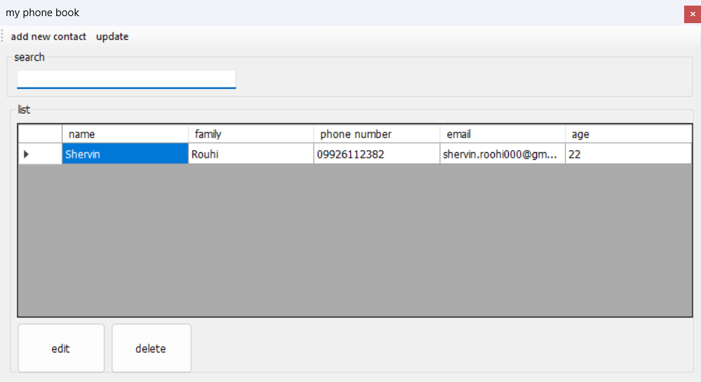
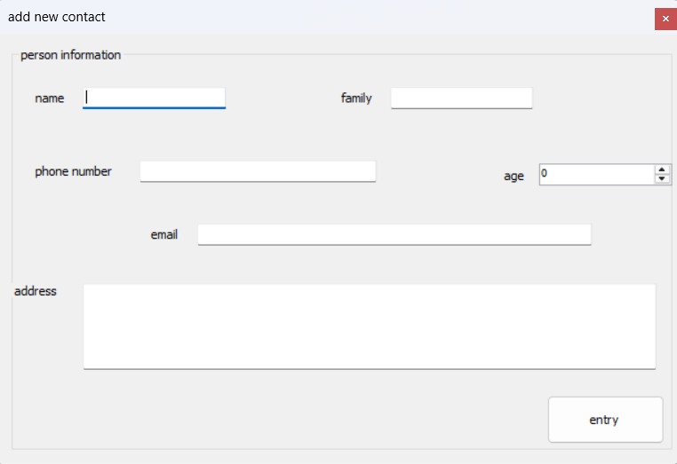

# MyContact - Phone Book Application

A simple Phone Book application built with C# Windows Forms and SQL Server.

## Features

* Add new contacts
* Edit existing contacts
* Delete contacts
* Search contacts by name or family name
* Store and manage data using SQL Server
* Input validation for phone numbers and email addresses

## Technologies Used

* C#
* .NET Framework 4.7.2
* Windows Forms
* SQL Server
* ADO.NET

## Screenshots

### Main Window


### Add / Edit Contact


## Versions

| Branch | Data Access Technology |
|--------|----------------------|
| main | ADO.NET |
| entity-framework | Entity Framework |

## Database Setup

Open SQL Server Management Studio (SSMS) and execute the following script:

```sql
CREATE DATABASE mycontact_DB;
GO
USE mycontact_DB;
GO
CREATE TABLE mycontact (
    contactid INT PRIMARY KEY IDENTITY(1,1),
    name NVARCHAR(100),
    family NVARCHAR(100),
    mobile NVARCHAR(20),
    email NVARCHAR(100),
    age INT,
    address NVARCHAR(500)
);
```

## Prerequisites

* Visual Studio 2019 or later
* SQL Server 2017 or later
* .NET Framework 4.7.2

## Configuration

Update the connection string in the `App.config` file with your SQL Server instance name:

```xml
<connectionStrings>
  <add name="MyContactDB"
       connectionString="Data Source=YOUR_SERVER_NAME;Initial Catalog=mycontact_DB;Integrated Security=True"
       providerName="System.Data.SqlClient" />
</connectionStrings>
```

## How to Run

1. Clone the repository.
2. Create the database using the SQL script above.
3. Configure the connection string in `App.config`.
4. Open `mycontact.sln` in Visual Studio.
5. Build and run the project.

## License

This project is licensed under the MIT License.

## Author

Developed by **Shervin Rouhi**

[](http://www.linkedin.com/in/shervin-rouhi-661143404)
